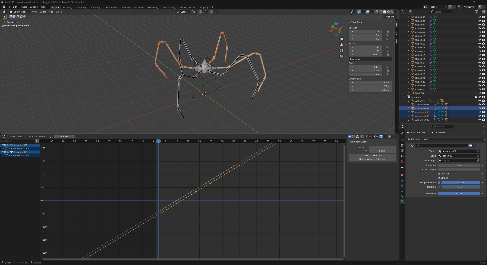
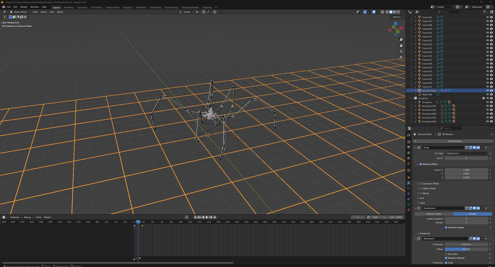

# Progetto Computer Graphics - Alessadnro Alice 5725337

## Nel mio progetto blender ho modellato e animato una sorta di ragno robotico che si muove e cammina in una direzione costante, con vari effetti di movimento, rotazione e con effetti grafici di riflessi e luci con l'utilizzo di materiali e texture adatte.

### Step 1 

- Sono partito da un cilindro per modellare una sorta di gancio/congiunzione che utilizzero' per la gamba del mio ragno robotico.

### Step 2 

- Creo la prima meta' del perno sul quale le congiunzioni ruoteranno.

### Step 3 

- Specchio la meta' del perno in modo da avere un oggetto che possa suportare tre congiunzioni.

### Step 4

- Duplico due volte la congiunzione cosi' da riempire il perno.

### Step 5

- Inizio a sviluppare le componenti della gamba con una congiunzione quadrata solida e le parti lunghe delle gambe fatte da cilindri.

### Step 6

- Continuo a sviluppare la gamba duplicando alcune congiunzione e greando una sorta di piede fatto a puntina.

### Step 7

- Concludo la struttura della gamba roteando l'aggancio che andra' al corpo centrale di 90 gradi.

### Step 8

- Inizio con lo sviluppo del corpo centrale.

### Step 9

- Aggiungo dei dettagli e particolari nel corpo centrale.

### Step 10

- Chiudo il sopra e il sotto del corpo centrale.

### Step 11

- Metto un cone come diciamo involucro per il corpo e inizio a creare delle sorte di cavi che lo tengono aggrappato al corpo.

### Step 12

- Creo tutti i cavi per ogni angolo dell'esagono.

### Step 13

- Inizio ad assegnare i materiali ai vari oggetti.

### Step 14

- Assegno lo scheletro alla gamba in base ai perni e alle congiunzioni.

### Step 15

- Prima di unisco tutte le ossa e aggiungere un piccolo osso finale per comandare il movimento della gamba e impostare lo scheletro piu' sottile blocco il movimento su alcuni assi di alcune ossa in base alla posizione del perno a cui sono collegate.

### Step 16

- Dublico la gamba per ogni lato.

### Step 17

- Creo un cubo vuoto che utilizzero' come body controller al quale unisco il corpo centrale e attacco le gambe.

### Step 18

- Accorco la distanza con l'osso che controlla ogni gamba e il corpo centrale e alzo il corpo centrale per simulare che il ragno sia in piedi.

### Step 19

- Creo un path di movimento e lo assegno ad ogni gamba (ora il ragno se lo si muove sembra che salti).

### Step 20

- Salvo due keyframe e li metto in loop in modo da iniziare a creare il movimento delle gambe (se si preme play sul playback si vede il ragno che saltella).

### Step 21

- Sposto di 10 frame avanti la camminata di tre gambe (una si e una no) in modo da simulare una camminata e non un salto.

### Step 22

- registro il movimento anche in alto e in basso del corpo centrale aggiungendo un modificatore per la rotazione (noise) per rendere il movimento piu' realistico e naturale.

### Step 23

- Aggiungo un pavimento e lo faccio scorrere in modo da simulare lo spostamento del ragno con il movimento.

### Step 24

- Aggiungo alcuni ultimi ritocchi come luci, materiali e texture del pavimento (per la texture del pavimento ne ho scaricata una da questo sito https://polyhaven.com/textures/floor?utm_source=chatgpt.com).

### Step 25

- Assegno la texture al pavimento aggiusto le luci e gli ultimi dettagli e posiziono la fotocamera per il rendering finale.

## Rendering finale (immagine)

